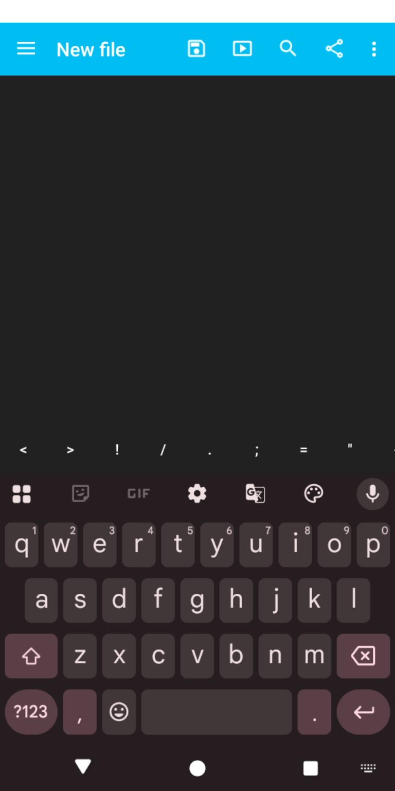
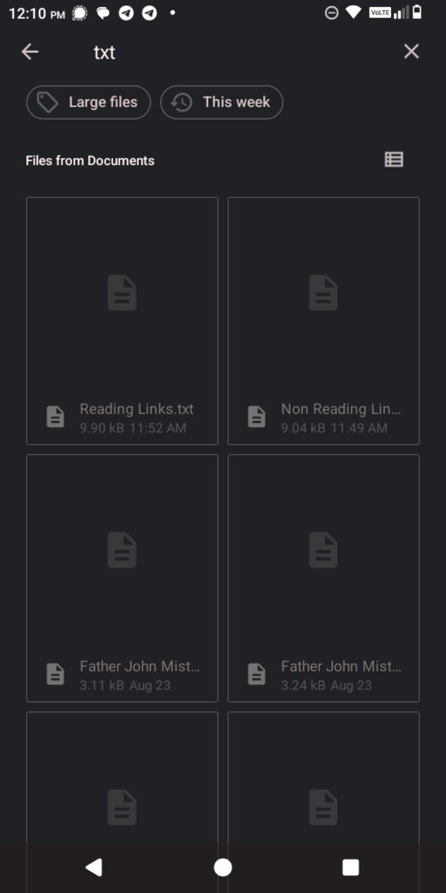
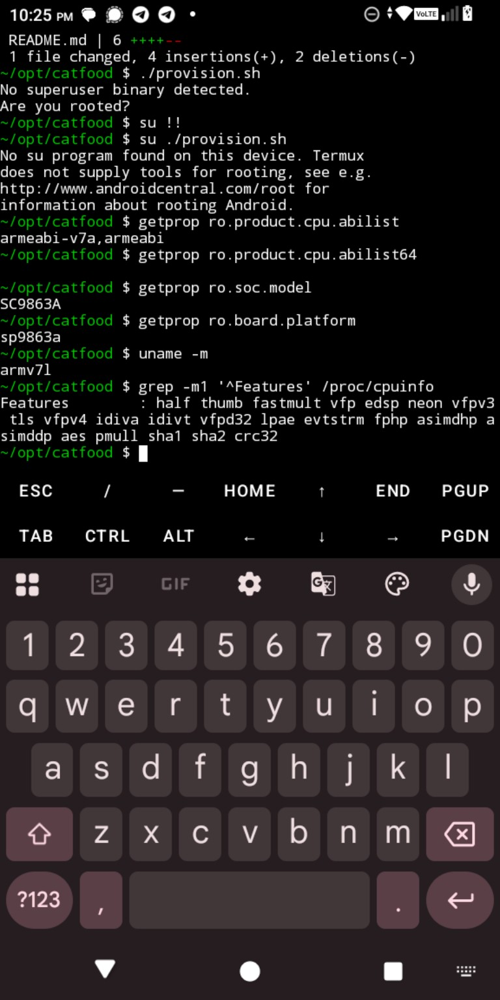
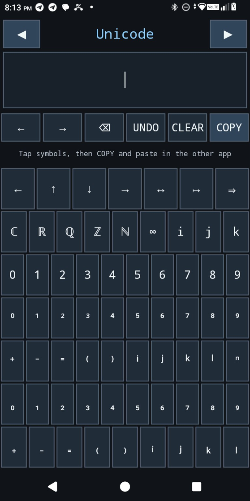

# txtpad / text-pad

This is the product note for a small, free, ad-free, phone-only plain-text editor. The screenshots below are references supplied during the August 25, 2026 discussion. They are evidence about useful pieces, not specifications to copy wholesale.

## Design center

The editing screen should give the phone back to the text:

- one large text area;
- a permanently dark background with light text;
- one obvious **Save** action;
- almost no other persistent chrome;
- Gboard remains the normal keyboard, including swipe typing;
- plain Unicode text only: no Markdown mode or rendered preview;
- bullets, em dashes, and similar marks are literal characters inserted by the keyboard;
- line numbers may be shown, but must be removable.

Do not turn every capability into a toolbar button. File management, search, sorting, and preferences can exist without permanently shrinking the editing surface.

## User stories

### Write and save

As a phone user, I can open txtpad and immediately type into a large uncluttered area, then save with one unmistakable action.

### Reopen work without desktop-style tabs

As a phone user, I can return to a recent file without maintaining a strip of tiny tabs. Recent files are more useful here than tabs.

### Find an old file

As a phone user, I can search filenames and file contents instead of remembering a directory path. Intelligent or vector-assisted search is welcome, but ordinary exact search must remain understandable.

### Reach unusual files when needed

As a phone user, I can deliberately show hidden files and change the file sort order. These controls belong in the file view, not on the editing canvas.

### Type programming punctuation without abandoning Gboard

As a phone user, I can keep Gboard and its swipe input while txtpad supplies a narrow, app-owned row for hard-to-reach characters. The reference row was:

`<  >  !  /  .  ;  =  "`

The exact contents may change. The important point is that this is an editor view above Gboard, not a replacement system keyboard.

### Copy text without fiddling with selection handles

As a phone user, I have **Copy All** for the common case. A searchable clipboard archive is also desirable, with roughly the latest 3–7 entries easy to reach and older entries available without crowding the editor.

### Use the existing Unicode work

As a phone user, I can eventually reach the repository's Programmer's Unicode Picker from the editing workflow. Whether that becomes an embedded surface or remains a copy/paste handoff is still open.

## Decisions and open choices

| Area | Current direction |
| --- | --- |
| Editor | Dark, light text, one large plain-text area, obvious Save action |
| Visible chrome | Keep nearly empty; no permanent panels or general-purpose toolbar |
| Markup | None; store and display literal Unicode text |
| Tabs | Not needed; prefer recent files |
| Line numbers | Optional and removable |
| File view | Recent files, explicit show-hidden toggle, sort controls |
| Search | Filenames and contents; exact retrieval must work even if semantic search is added |
| Keyboard | Preserve Gboard/swipe; optional app-owned extra-key row |
| Clipboard | Copy All plus a small, searchable history/archive |
| Storage | Phone files plus optional cloud; Google Drive is acceptable, and modest hosted storage is also possible |
| Language/runtime | Phone-only and deliberately non-Java in application code; reuse the repository's native/Idriç direction where it fits |
| Unicode picker | Reuse is wanted; the integration shape is undecided |

Clipboard access is an Android boundary issue: there is no complete public NDK clipboard API. Native application code can call the platform clipboard service across JNI without introducing handwritten Java application code. That is an implementation constraint, not a reason to weaken the UI.

## Reference screenshots

### Editing surface and punctuation row

Keep the large dark canvas and the app-owned punctuation row. The reference app also exposes menu, run, search, share, and overflow actions in the top bar; txtpad should not treat that crowded action set as the target. Save is the only action that must remain immediately obvious.

### Android file view

This is evidence for a separate file-finding surface. It should gain the requested hidden-file, sorting, recent-file, and filename/content-search behavior without leaking those controls into the editor.

### Extra keys above the ordinary keyboard

Termux demonstrates the interaction model: the host app owns the narrow row while the ordinary keyboard remains below it. txtpad needs a smaller text-editing row, not Termux's full terminal key set.

### Existing Programmer's Unicode Picker

The existing picker proves a native, copy/paste-oriented Unicode surface on the target phone. It is a source of capabilities for txtpad, not a proposal to place this whole grid permanently inside the editor.

## Non-goals for the first useful version

- Markdown rendering or preview;
- a desktop-style tab bar;
- a permanent file tree, clipboard panel, search panel, or symbol palette;
- replacing Gboard with a system IME;
- exposing every possible command on the editing screen.

The first useful slice is smaller: edit one plain-text file comfortably, save it reliably, reopen it, and preserve the phone's limited screen area.
